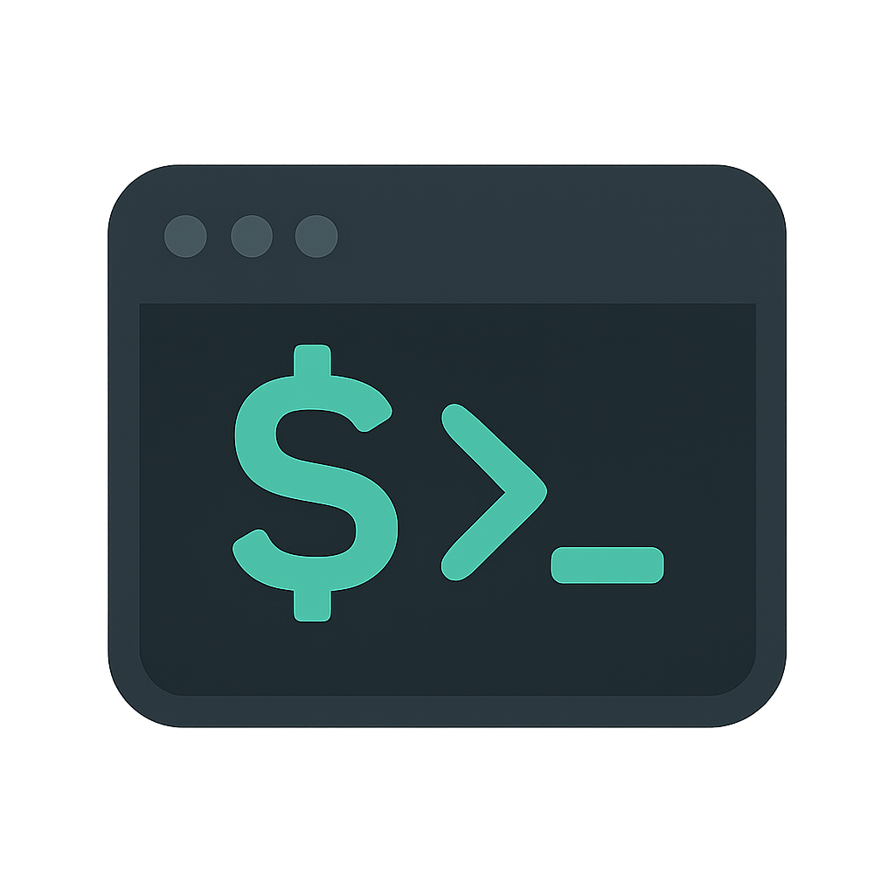

# Budget Tracker TUI

<p align="center">
  
</p>

A fast, modern, and efficient Terminal User Interface (TUI) application for tracking your personal budget, built with [Rust](https://www.rust-lang.org) and [Ratatui](https://ratatui.rs).

## 📚 Table of Contents

- [🖼️ Screenshots](#️-screenshots)
- [✨ Features](#-features)
- [🚀 Getting Started](#-getting-started)
- [⚡ Quick Start](#-quick-start)
- [⚙️ Settings & Configuration](#️-settings--configuration)
- [📁 Data & CSV Format](#-data--csv-format)
- [References](#references)

## 🖼️ Screenshots

<p align="center">
  
  <br><i>Main transaction view with summary bar and help</i><br><br>
  
  
  <br><i>Category summary with expandable/collapsible categories</i><br>
  
  
  <br><i>Monthly summary with interactive chart and budget line</i><br><br>
  
  ### SEE MORE SCREENSHOTS HERE <>
  <details>
  <summary>Click to see all monthly summary screenshots</summary>
  <p align="center">
    
    <br><i>Multi-Month Line chart</i><br><br>
    
    <br><i>Cumulative chart with budget line</i><br><br>
    
    <br><i>Cumulative and multi month chart</i><br><br>
    
    <br><i>Options Menu with Help / Keybindings Menu Open</i><br><br>
    
    <br><i>Category/Sub-Category Fuzzy Search Enabled view</i><br><br>
  </p>
</details>
</p>

## ✨ Features

- **Intuitive Terminal UI:** Manage your finances directly from your terminal with a clean, responsive interface (TUI).
- **Transaction Management:** Add, view, edit, and delete income and expenses.
- **Recurring Transaction:** Setup transactions that automatically recur at select frequencies.
- **Advanced Filtering:** Filter transactions by date, description, category, type, and amount (including advanced multi-field filters).
- **Smart Date Navigation:** Use `+`/`-` to adjust dates by day, and `Shift + Left/Right` to jump by month in date fields.
- **Categorization:** Hierarchical categories and subcategories for all transactions, now managed in-app and stored in a local SQLite catalog.
- **Fuzzy Search:** Toggleable option to fuzzy search categories/subcategories for quick selection.
- **Summaries & Charts:** Visualize your spending/income by month and by category, with interactive charts and tables.
- **Budget Tracking:** Set a monthly target budget, assign per-category expense budgets, and review progress in the dedicated budget view.
- **Data Persistence:** Transactions are stored in a configurable CSV file, categories are stored in a local SQLite database, and app preferences are saved in a config file.
- **Cross-Platform:** Runs on Windows, macOS, and Linux.
- **Keyboard-Driven:** Fully operable with keyboard shortcuts for every action and mode. Press `Ctrl+H` for a help menu.
- **Update Checker:** Automatically checks for updates on startup and notifies you of new versions.
- **Robust CSV Support:** Flexible date parsing, easy import/export, and Excel compatibility.
- **High Precision:** Uses decimal arithmetic (no floating point errors) for accurate financial calculations.
- **Built with Rust:** Safety, speed, and reliability.

## 🚀 Getting Started

### Windows Installer (Recommended for Windows Users)

If you are on **Windows**, you can download and run the latest installer for a quick and easy setup. This is the simplest way to get started on Windows—no Rust or Cargo required!
(NOTE: I do not have a windows developer licence so it will be an unknown publisher)

- [Download the latest Windows installer from the Releases page](https://github.com/Feromond/budget_tracker_tui/releases)

### Prerequisites (for manual/cargo install)

- [Rust](https://www.rust-lang.org/tools/install) (includes `cargo`)
- No separate SQLite installation is required for normal builds; the app bundles SQLite through `rusqlite`.

### Installation & Running
> Still working on adding support for direct downloads via some linux package managers

**Build and Run Manually:**

```bash
# Clone the repository
git clone https://github.com/Feromond/budget_tracker_tui
cd budget_tracker_tui

# Build the project (use --release for optimized build)
cargo build --release

# Run the executable
./target/release/Budget_Tracker
```

**Install Globally with Cargo (Recommended for Linux/macOS):**

```bash
# Navigate to the project directory
cd budget_tracker_tui

# Install the binary to Cargo's bin directory
cargo install --path .
```

After installation, the `Budget_Tracker` command should be available in your terminal directly.

_Optional Tip:_ For even quicker access, set up a shell alias:

```bash
# Example for bash/zsh (add to your .bashrc or .zshrc)
alias bt='Budget_Tracker'
```

Then, you can just type `bt` to launch the app.

## ⚡ Quick Start

1. **Launch the app:** `Budget_Tracker` (or `bt` if you set up the alias)
2. **Add a transaction:** Press `a`, fill in the fields, and press `Enter` to save.
3. **Navigate:** Use `↑`/`↓` to move between transactions, `PageUp`/`PageDown` to jump by pages, `Ctrl+↑`/`Ctrl+↓` to jump to first/last transaction.
4. **Sort transactions:** Press `1-6` to sort by Date, Description, Category, Subcategory, Type, or Amount respectively.
5. **Manage transactions:** Press `e` to edit, `d` to delete, `f` to filter, `r` to manage recurring transactions.
6. **View summaries:** Press `s` for monthly summary, `c` for category summary, and `b` for the budget view.
7. **Change settings:** Press `o` to open settings (change the transactions CSV path, SQLite database path, target budget, and manage categories).
8. **Quit:** Press `q` or `Esc`.
9. **Help:** Press `Ctrl+H` at any time to view the keybindings menu for the current mode.

## ⚙️ Settings & Configuration

- **Data File Path:**
  - The path to your `transactions.csv` file is configurable in-app (press `o` for settings).
  - Default locations: - **Linux:** `$XDG_DATA_HOME/BudgetTracker/transactions.csv` (usually `~/.local/share/BudgetTracker/transactions.csv`) - **macOS:** `~/Library/Application Support/BudgetTracker/transactions.csv` - **Windows:** `%APPDATA%\BudgetTracker\transactions.csv` (e.g.,
    `C:\Users\<YourUsername>\AppData\Roaming\BudgetTracker\transactions.csv`)
  - **Cross-Device Sync:** You can set your data file path to a cloud-synced folder (iCloud, Google Drive, Dropbox, OneDrive, etc.) to automatically sync your budget data across multiple devices. Just point the data file path to a location within your cloud storage folder!
- **Database Path:**
  - The category catalog is stored in a SQLite database file, configurable in-app from Settings.
  - By default, the database file is named `budget.db` and is placed alongside your current transactions CSV file.
  - On first run with a new database, the app seeds it with the default category catalog.
- **Manage Categories:**
  - From Settings, use **Manage Categories** to open the category catalog and add, edit, or delete categories/subcategories.
  - Expense categories can optionally store a per-category target budget for use in the budget view.
- **Target Budget:**
  - Set a monthly target budget in settings. This is used in the monthly summary and budget view.
- **Hourly Rate:**
  - (Optional) Set your hourly earning rate to toggle a view that shows transaction costs in "hours worked".
- **Fuzzy Search:**
  - Enable or disable the fuzzy search input for category selection (toggle in Settings menu `o`).
- **Config File:**
  - The application's settings are saved in a `config.json` file, which is stored in your OS's **config directory**:
    - **Linux:** `~/.config/BudgetTracker/config.json`
    - **macOS:** `~/Library/Application Support/BudgetTracker/config.json`
    - **Windows:** `C:\Users\<YourUsername>\AppData\Roaming\BudgetTracker\config.json`
  - This is separate from the data file location, which is in your OS's data directory (see above).

## 📁 Data & CSV Format

- **CSV Columns:** `date, description, amount, transaction_type, category, subcategory`
- **Date Format:** Flexible! Accepts `YYYY-MM-DD`, `YYYY/MM/DD`, `DD/MM/YYYY`, or `DD-MM-YYYY`.
- **Transaction Type:** `Income` or `Expense` (case-insensitive, also accepts `i`/`e`)
- **Category/Subcategory:** Transaction rows should reference categories that exist in the SQLite category catalog. You can manage that catalog in-app from Settings.
- **Import/Export:** You can edit the transaction CSV in Excel/LibreOffice or import from other tools (just match the columns and use valid categories). SQLite support currently backs category data; transaction storage remains CSV for now.
- **Data Safety:** The app will not overwrite your transaction CSV unless you save a transaction, close the program, or change settings. Category edits are written to the SQLite database.

## References

**[Ratatui](https://ratatui.rs)**
**[Rust](https://www.rust-lang.org/)**
